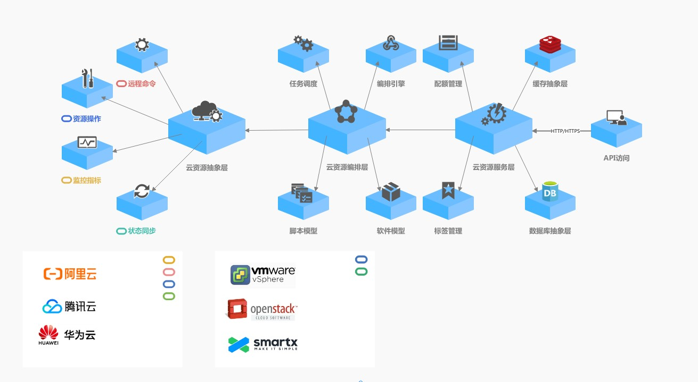

StratoCloud
==========
**StratoCloud**是一款开源的**多云/混合云管理平台(Cloud Management Platform, CMP)**，
屏蔽多云/混合云环境不同云厂商之间操作逻辑和API的差异，帮助您实现云资源的一站式编排、申请、审批与管理。

# 关键特性
* 云资源全生命周期管理
  * 实现云主机、云硬盘、弹性网卡、弹性IP、负载均衡、安全组等云资源的统一申请、变更、回收操作
* 多级租户
  * 支持按多级租户结构控制数据权限，实现不同子公司、部门、项目组等组织结构的数据隔离与共享
* 用户组与资源标签
  * 您可以使用用户组来与其他人共享您的云资源权限，通过资源标签控制用户组对云资源的访问
* 配额管理
  * 支持按租户、用户、云平台、云账号、资源类型、资源标签等多个维度进行云资源的配额管理
* 流程编排
  * 实现审批节点与多个任务节点的自由组合，可视化编排资源申请、变更、回收的审批流程
* 软件库与脚本库
  * 您可以设计平台无关的软件/脚本定义，只需设计一次即可在任意云上执行，简化您的应用、中间件、数据库与运维脚本的部署流程
* IP地址管理
  * 使用IP池对您的云主机IP地址进行统一管理
* 任务调度
  * 实时查看您的云上任务进度，支持失败重试，支持定时任务的集中式管理
* 资源编排[(商业版功能)](./docs/PREMIUM.md)
  * 通过资源栈蓝图设计您的资源拓扑，并以资源栈形式部署并管理您的资源拓扑
* 私有云管理[(商业版功能)](./docs/PREMIUM.md)
  * 支持对接OpenStack、vSphere、SmartX等私有云/虚拟化平台
* SSH/WinRM远程命令执行[(商业版功能)](./docs/PREMIUM.md)
  * 支持通过SSH/WinRM在私有云环境部署软件或执行脚本

# 逻辑架构


# 为什么选择StratoCloud?
* 多云/混合云管理
  * 一套系统轻松管理多云/混合云环境的各种云资源，提升资源交付与运维效率
* 用户自助服务
  * 使用StratoCloud来构建您的资源申请、变更、回收等审批流程，减少重复运维工作
* 多级租户权限模型
  * 灵活适配您所在公司的组织架构与运维制度
* 资源拓扑
  * StratoCloud的资源模型设计参考[TOSCA标准](https://docs.oasis-open.org/tosca/TOSCA/v2.0/TOSCA-v2.0.html)，自动化构建、发现和同步您的资源拓扑
* 领域驱动设计
  * 采用领域驱动的模块化设计思路，基于纯Java实现，易于部署和维护，支持国产化部署，满足信创需求。详见[设计考虑](./docs/DESIGN_CONSIDERATIONS.md)
* 可扩展性
  * 所有云平台的对接模块均为可插拔、开箱即用的Maven模块，无需改动主体代码，提升云平台对接开发效率。详见[二次开发参考](./docs/DEVELOPER_REFERENCE.md)
* 快速交付
  * 并行、异步的云平台调用逻辑，提升资源交付速度和界面响应速度

# 快速开始  
本小节将引导您快速安装StratoCloud。在您开始安装之前，请知悉“快速开始”的目的仅限于帮助您快速了解StratoCloud，为单机部署模式。如果有高可用部署需求，详见[商业版功能](./docs/PREMIUM.md)或[二次开发参考](./docs/DEVELOPER_REFERENCE.md)。
## 1.环境准备
* 最低配置：CPU 4核, 内存 8GB, 存储 50GB, Java 17
* 推荐配置：CPU 8核, 内存 16GB, 存储 50GB, Java 21
* 如果未安装Java，请前往[https://jdk.java.net/java-se-ri/21](https://jdk.java.net/java-se-ri/21)获取
* StratoCloud可运行在Java 17及以上版本(建议选用Java 21)，您可以使用`java -version`命令检查您的Java版本:
```shell
$ java -version
openjdk version "21.0.2" 2024-01-16
OpenJDK Runtime Environment (build 21.0.2+13-58)
OpenJDK 64-Bit Server VM (build 21.0.2+13-58, mixed mode, sharing)
```
## 2.下载安装包
* Windows用户请点击[此处](https://github.com/stratocloud-cmp/stratocloud/releases/download/v1.0.0/stratocloud-release-1.0.0.zip)下载安装包，解压到您的本地磁盘，例如`D:\stratocloud`。
* macOs和Linux用户请运行以下命令:
```shell
# 下载安装包
$ wget https://github.com/stratocloud-cmp/stratocloud/releases/download/v1.0.0/stratocloud-release-1.0.0.zip

# 解压
$ unzip stratocloud-1.0.0-release.zip
```
## 3.修改配置文件
* StratoCloud默认支持使用H2、PostgreSQL或MySQL作为后端存储，您可以根据需求选用其中一种 (H2数据库为内置数据库无需单独部署)。如果有使用其他国产数据库需求，详见[商业版功能](./docs/PREMIUM.md)或[二次开发参考](./docs/DEVELOPER_REFERENCE.md)  
* 请根据您选用的数据库参考以下配置文件，修改并覆盖到`stratocloud-1.0.0-release/config/application.yaml`  
* 如果您想直接使用默认配置，请跳过本小节并前往[第4步](#4启动服务)

**H2数据库(内置):**
```yaml
server:
  port: 8080 #您可以将`8080`替换成其他端口
spring:
  application:
    name: "strato-cloud"
  datasource:
    driver-class-name: org.h2.Driver
    url: jdbc:h2:file:/etc/stratocloud/storage/h2 #您可以将`/etc/stratocloud/storage/h2`替换成其他文件路径
    username: stratocloud #您可以将`stratocloud`替换成您的数据库用户名
    password: stratocloud #您可以将`stratocloud`替换成您的数据库密码
    hikari:
      minimum-idle: 5
      maximum-pool-size: 200
      auto-commit: true
      idle-timeout: 30000
      max-lifetime: 1800000
      connection-timeout: 20000
      connection-test-query: SELECT 1
  jpa:
    generate-ddl: false
    hibernate:
      ddl-auto: update
    database: h2
    show-sql: false
    open-in-view: true

logging:
  file:
    path: /etc/stratocloud/log
```  

**PostgreSQL数据库:**
```yaml
server:
  port: 8080 #您可以将`8080`替换成其他端口
spring:
  application:
    name: "strato-cloud"
  datasource:
    driver-class-name: org.postgresql.Driver
    #请确保在PostgreSQL实例中建好名为stratocloud的数据库
    url: jdbc:postgresql://127.0.0.1:5432/stratocloud #您可以将`127.0.0.1:5432`替换成您的PostgreSQL地址
    username: stratocloud #您可以将`stratocloud`替换成您的数据库用户名
    password: stratocloud #您可以将`stratocloud`替换成您的数据库密码
    hikari:
      minimum-idle: 5
      maximum-pool-size: 200
      auto-commit: true
      idle-timeout: 30000
      max-lifetime: 1800000
      connection-timeout: 20000
      connection-test-query: SELECT 1
  jpa:
    generate-ddl: false
    hibernate:
      ddl-auto: update
    show-sql: false
    open-in-view: true

logging:
  file:
    path: /etc/stratocloud/log
```  

**MySQL数据库:**
```yaml
server:
  port: 8080 #您可以将`8080`替换成其他端口
spring:
  application:
    name: "strato-cloud"
  datasource:
    driver-class-name: com.mysql.cj.jdbc.Driver
    #请确保在MySQL实例中建好名为stratocloud的数据库
    url: jdbc:mysql://127.0.0.1:3306/stratocloud?useSSL=false&serverTimezone=UTC #您可以将`127.0.0.1:3306`替换成您的MySQL地址
    username: stratocloud #您可以将`stratocloud`替换成您的数据库用户名
    password: stratocloud #您可以将`stratocloud`替换成您的数据库密码
    hikari:
      minimum-idle: 5
      maximum-pool-size: 200
      auto-commit: true
      idle-timeout: 30000
      max-lifetime: 1800000
      connection-timeout: 20000
      connection-test-query: SELECT 1
  jpa:
    generate-ddl: false
    hibernate:
      ddl-auto: update
    show-sql: false
    open-in-view: true
```  

## 4.启动服务
请在命令行中执行以下命令以切换到stratocloud-1.0.0-release/bin目录
```shell
$ cd stratocloud-1.0.0-release/bin
```
执行启动脚本(Linux/macOS环境):  
```shell
#启动StratoCloud
$ nohup sh startup.sh &

#查看日志
$ tail -f /etc/stratocloud/log/spring.log
```
执行启动脚本(Windows环境):
```shell
#启动StratoCloud
$ startup.cmd
```
使用浏览器访问StratoCloud页面，如果是本机部署，默认地址为[http://127.0.0.1:8080](http://127.0.0.1:8080)。默认用户名与密码一致: `super_admin`

# 文档
[1.使用手册](./docs/USER_GUIDE.md)  
[2.最佳实践](./docs/BEST_PRACTICES.md)  
[3.设计考量](./docs/DESIGN_CONSIDERATIONS.md)  
[4.二次开发参考](./docs/DEVELOPER_REFERENCE.md)  
[5.商业版功能](./docs/PREMIUM.md)

# 前端项目
[stratocloud-ui](https://github.com/stratocloud-cmp/stratocloud-ui)

# 联系我们
[stratocloud@163.com](mailto:stratocloud@163.com)

# License
[Apache 2.0 License](LICENSE)


