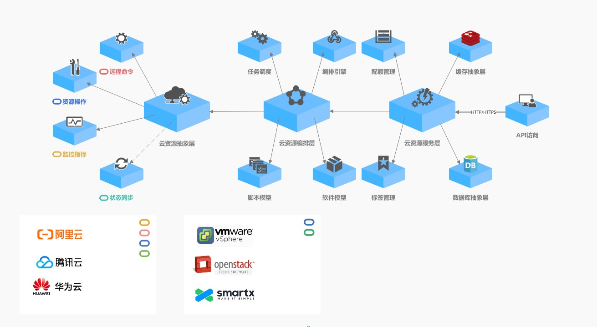

# 逻辑架构

**StratoCloud**的服务端在逻辑上可分为以下三层：
* 云资源服务层: 负责整合云资源及其他模块的业务逻辑，与数据库、缓存交互，并提供API接口
* 云资源编排层: 提供任务调度、资源编排、软件模型、脚本模型等能力
* 云资源抽象层: 适配不同云厂商、不同云资源的API接口，以抽象接口的形式向上提供资源操作、远程命令、监控指标、状态同步等能力

# 设计考虑
* **自助服务**
  * StratoCloud通过提供工单审批、多维度权限模型、配额管理、IP池等能力，实现云资源服务的自助化，简化运维管理流程
* **自动化**
  * StratoCloud通过提供流程编排、资源编排、软件库、脚本库、定时任务管理等能力，实现云资源交付、运维的自动化
* **可扩展**
  * StratoCloud提供多个扩展接入点以满足不同场景下的扩展需求，包括云平台类型可扩展、云资源类型可扩展、流程节点类型可扩展、命名规则可扩展
* **可插拔**
  * StratoCloud使用的数据库、缓存、消息队列均可被替换为其他实现
* **轻量化**
  * StratoCloud默认采用模块化单体架构，同时尽可能简化技术栈，后端核心代码为纯Java实现，降低开发、部署与维护难度

# 资源模型
* **Resource**
  * 云资源，每个云资源对应一个云平台上的实体对象，大到一个可用区、一个VPC，小到一台云主机、一个ELB实例、甚至一条安全组规则，在StratoCloud上均被视为一个云资源
* **ResourceAction**
  * 云资源操作，每种云资源可执行的操作类型由云资源的类型和其实时状态共同决定，每种云资源的每种操作所需的参数均由对应的动态表单所定义。
* **Relationship**
  * 云资源关系，每个关系包含Source和Target两个端点，方向为Source->Target，Source和Target分别对应一个云资源
* **RelationshipAction**
  * 云资源关系操作，每个云资源关系具有连接(Connect)和断开(Disconnect)两种关系操作
* **Requirement**
  * 云资源依赖关系，对于某个Relationship的Source，该Relationship被称为Source资源的Requirement
* **Capability**
  * 云资源被依赖关系，对于某个Relationship的Target，该Relationship被称为Target资源的Capability
# 权限模型
StratoCloud的角色分为以下4种权限级别:
* **SuperAdmin**: 全局超级管理员，对任意功能、任意数据范围均有权限
* **TenantSuperAdmin**: 租户级超级管理员，对任意功能均有权限，但仅对某个租户的数据有权限
* **TenantAdmin**: 租户级管理员，仅对被授权的功能有权限，仅对某个租户的数据有权限
* **NormalUser**: 普通用户，仅对被授权的功能有权限，仅对属于自己的数据有权限

StratoCloud的实体对象分为以下3种数据权限级别:
* **Auditable**: 仅全局超级管理员可操作
* **Tenanted**: 全局超级管理员、租户级超级管理员、被授权的租户级管理员可操作
* **Controllable**: 全局超级管理员、租户级超级管理员、被授权的租户级管理员、被授权的普通用户可操作

此外，云资源(Resource)是一种特殊的Controllable实体对象，若用户A所在用户组的所有资源标签均可在资源B上找到对应的标签值，或资源B是公有资源，则用户A对资源B具有访问权限。举例来说，假设某租户下存在4个用户组:
* 用户组G1，标签: `应用: A1`
* 用户组G2，标签: `应用: A2`
* 用户组G3，标签: `项目: P1`
* 用户组G4，标签: `项目: P2`

以及4个云资源:
* 私有资源R1，标签: `应用: A1` `项目: P1`
* 私有资源R2，标签: `应用: A2` `项目: P2`
* 私有资源R3，标签: `应用: A2`
* 公有资源R4，无标签

以及3个用户:
* 用户U1，属于用户组G1、G2、G3
* 用户U2，属于用户组G1、G2、G4
* 用户U3，属于用户组G2

则用户U1对R1、R4有权限，用户U2对R2、R4有权限，用户U3对R2、R3、R4有权限